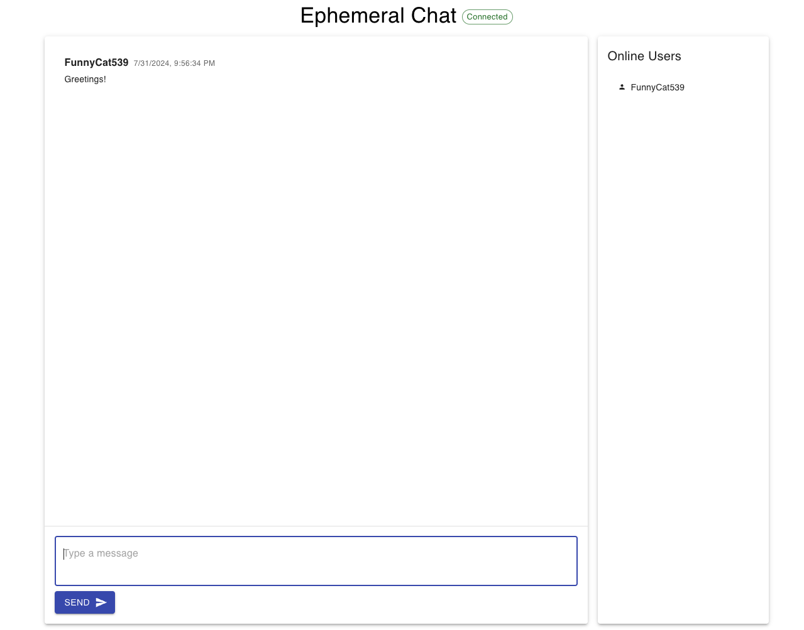

# Tutorial: Building and Deploying Your First App with Klotho 2

## 1. Introduction
Discover how to create, run, and deploy a sample app using Klotho 2. Klotho 2 enables you to work with high-level cloud constructs, streamlining deployment with a single command. More details are available in our [announcement post](https://klo.dev/blog/klotho-2-release).

In this tutorial, we'll build an ephemeral chat application using:

- React (Frontend)
- FastAPI (REST API)
- SQLAlchemy and Alembic (Database ORM and migrations)
- PostgreSQL (Database)

Our app will be containerized with Docker Compose for local development and then deployed to the cloud using Klotho 2.

> ⚠️ **Warning**: Klotho 2 is in pre-alpha status. Some features may be unstable or incomplete. This sample app stores database passwords in plain text and should not be considered production-ready.

## 2. Prerequisites and Installation
- Docker
- Python 3.12
- Node.js
- Pipenv
- Pulumi
- Git (optional)
- Klotho 2 CLI
- AWS Account (for deployment)
- Basic knowledge of Python, React, Docker, and cloud concepts

### Installing Klotho 2 CLI
1. Download the latest release from the [Klotho 2 GitHub releases page](https://github.com/klothoplatform/klotho/releases).
2. Extract the file and move the `klotho` binary to a directory in your PATH.
3. Verify the installation by running `klotho -h` in your terminal.

For detailed instructions, refer to the [official Klotho 2 documentation](https://klo.dev/docs).

### Setting Up AWS Credentials
Klotho 2 uses standard AWS credential management methods:

1. AWS CLI: If configured, Klotho 2 will use these credentials automatically.
2. Environment Variables: Set `AWS_ACCESS_KEY_ID` and `AWS_SECRET_ACCESS_KEY`.
3. Shared Credentials File: Klotho 2 can use the `~/.aws/credentials` file.

Ensure your AWS account has the necessary permissions to create and manage the resources defined in your `infra.py` file.

## 3. Setting Up the Project
Clone the repository and install dependencies:

```bash
git clone https://github.com/klothoplatform/k2-sample-apps.git
cd k2-sample-apps/chat-app
pipenv install
```

Navigating this repo, you'll find the following directories:
- `app` contains the source code for the backend lives in the `app` 
- `frontend` contains the react frontend 
- `infra.py` comes pre-configured for deployment with Klotho 2 and is located in the iac directory. 
- `alembic` contains database migration scripts and configuration.

## 4. Local Development
Running commands will require using `docker-compose` and `pipenv`. Some example commands are:
- `docker-compose up --build -d`: Start all Docker Compose services
- `docker-compose up --build`: Start services with logs
- `docker-compose down`: Stop all services

Commands that require the database to be up:
- `docker-compose run -rm -e GENERATE_MIGRATION=true web pipenv run alembic revision --autogenerate -m "Message"`: Create a new database migration with a message
- `docker-compose run -rm web pipenv run alembic upgrade head`: Apply migrations
- `docker-compose run -rm web pipenv run alembic downgrade <revision>`: Revert to a previous migration

### Rebuilding the frontend
To rebuild the frontend, run the following commands:

```bash
cd frontend
npm install
npm run build
```

### Running the app
To run the app locally after building the frontend:

```bash
docker-compose up --build
```

This starts the app at `http://localhost:8000`, performs migrations, and streams logs to stdout.



## 5. Understanding Constructs and Configurations
Constructs are high-level abstractions representing cloud resources. Klotho 2 supports various constructs such as containers, databases, and APIs.

Each construct offers customizable configuration options, allowing you to specify details like container images or database names.

> **Note**: Klotho 2 currently lacks custom support for secret configuration values. Exercise caution with sensitive information.

## 6. The Klotho 2 CLI and Deployment

### Initializing a New Project
Create a new Klotho 2 project:

```bash
klotho init
```

Following the prompts generates a basic `infra.py` file and sets up the development environment.

### Declaring Resources in infra.py
`infra.py` defines your cloud resources using Python. Here's a sample from this application:

```python
import os
import klotho
import klotho.aws as aws

app = klotho.Application(
    "chat-app",
    project=os.getenv("PROJECT_NAME", "my-project"),
    environment=os.getenv("KLOTHO_ENVIRONMENT", "default"),
    default_region=os.getenv("AWS_REGION", "us-east-1"),
)

dir_path = os.path.dirname(os.path.realpath(__file__))
dockerfile_path = os.path.abspath(os.path.join(dir_path, "..", "Dockerfile"))

fastapi = aws.FastAPI('my-fastapi',
                      context="..",
                      dockerfile=dockerfile_path,
                      health_check_path="/",
                      health_check_matcher="200-299",
                      health_check_healthy_threshold=2,
                      health_check_unhealthy_threshold=8,
                )

postgres = aws.Postgres("my-postgres", username="admintest", password="password123!", database_name="mydb",)
fastapi.bind(postgres)
```

> **Note**: Do not execute `infra.py` directly or import it into your application layer. The Klotho 2 CLI reads this file to deploy resources.

### Connecting Your App to Klotho 2 Constructs
Klotho 2 uses environment variables to connect your app with defined resources:

1. Klotho 2 generates environment variables based on `infra.py` connections.
2. Your app accesses these variables at runtime.
3. For our chat app, the FastAPI service connects to Postgres using `MY_POSTGRES_RDS_ENDPOINT`.

Example usage in Python:

```python
import os
from sqlalchemy import create_engine

db_host = os.getenv("MY_POSTGRES_RDS_ENDPOINT", "db:5432")
database_url = f"postgresql+asyncpg://username:secretpassword!@{db_host}/dbname"
engine = create_engine(database_url)
```

### Deploying the App
Deploy your app using:

```bash
klotho up ./iac/infra.py
```

This command deploys resources defined in `infra.py`. After successful deployment, access your app at the provided URL.

### Gathering Outputs
Once the app has deployed successfully, you can view outputs from stdout directly.

[screenshot]

In this examples, We want to retrieve the Load Balancer URL for the FastAPI service. 

### Cleaning Up
Remove deployed resources:

```bash
klotho down ./iac/infra.py
```

## 7. Conclusion
You've learned how to build and deploy a sample app using Klotho 2, creating a chat application with React, FastAPI, and PostgreSQL.

Key takeaways:
- Klotho 2 simplifies cloud deployments with high-level constructs.
- `infra.py` declaratively defines your cloud resources.
- Klotho 2 CLI commands manage the entire deployment lifecycle.

This tutorial demonstrates how Klotho 2 can streamline your cloud development process, allowing you to focus on application logic rather than infrastructure details.

## 8. Additional Resources
- [Klotho Landing Page](https://klo.dev/index.html)
- [Klotho GitHub Repository](https://github.com/klothoplatform/klotho)
- [Klotho Discord Community](https://klo.dev/discordurl)
- [Klotho Documentation](https://klo.dev/docs)
- [AWS Documentation](https://docs.aws.amazon.com)
- [FastAPI Documentation](https://fastapi.tiangolo.com)
- [React Documentation](https://reactjs.org/docs)
